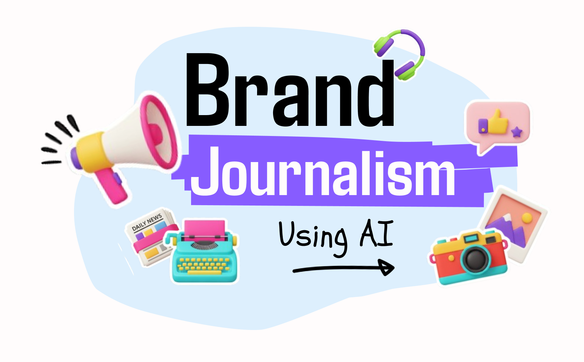
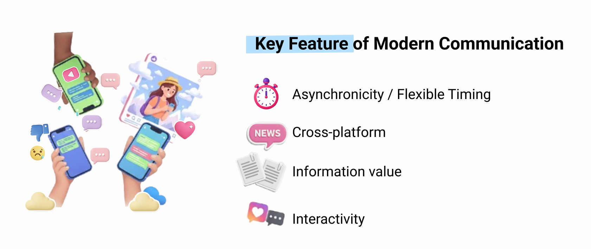
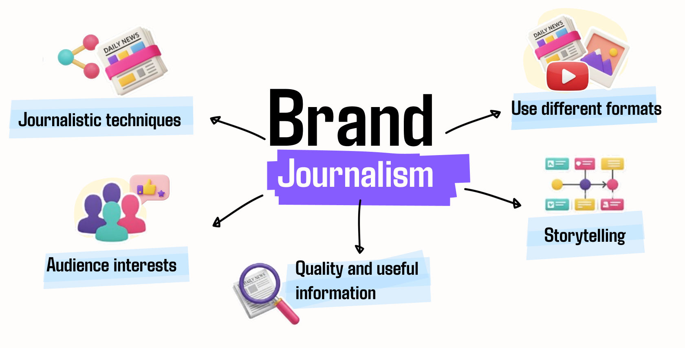
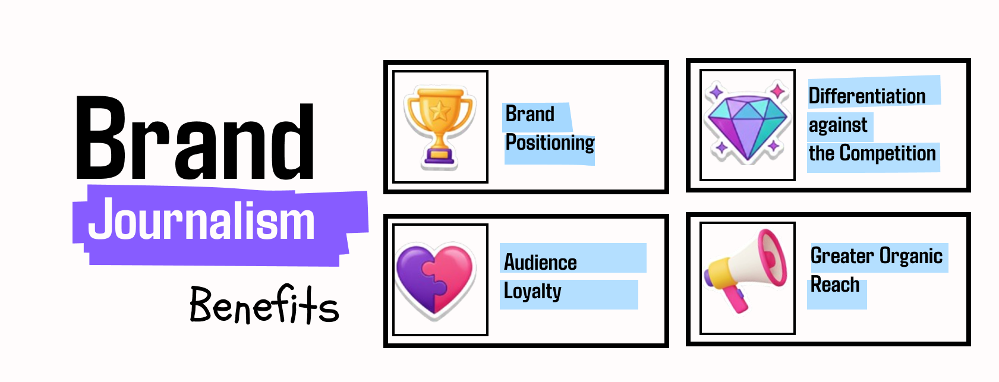
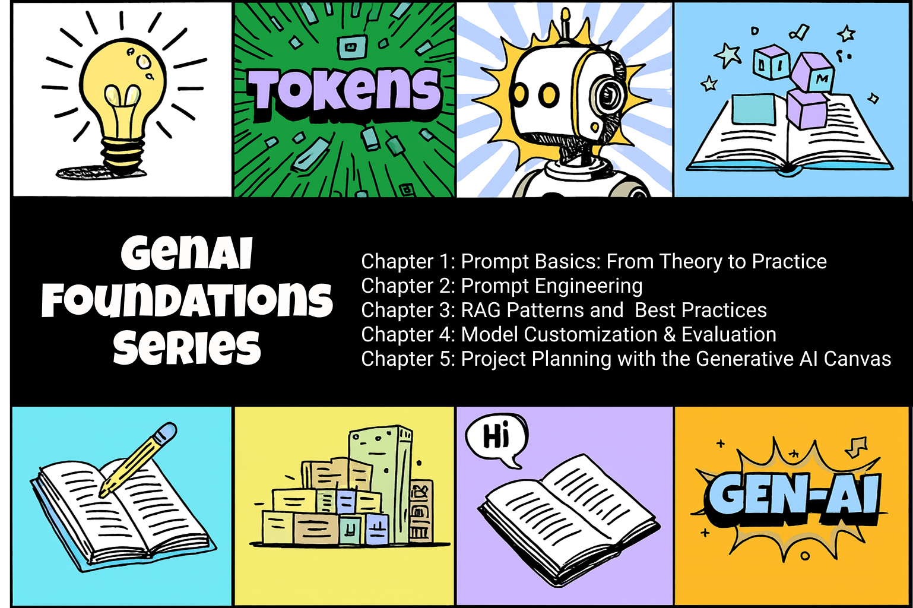
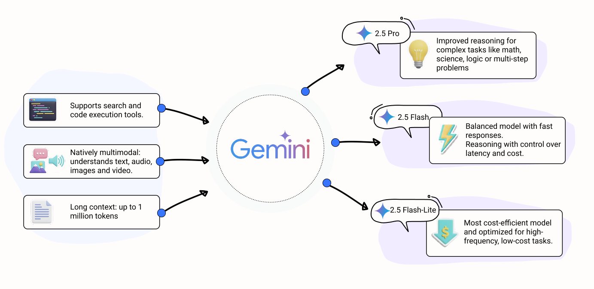
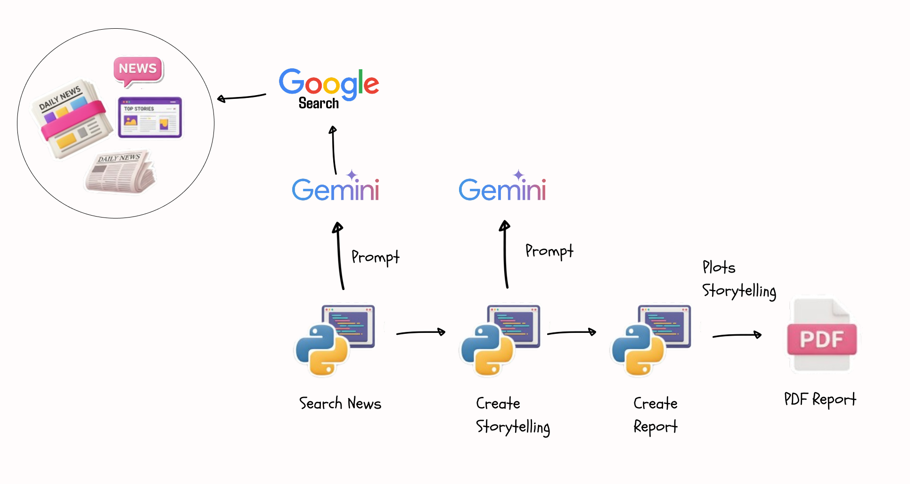
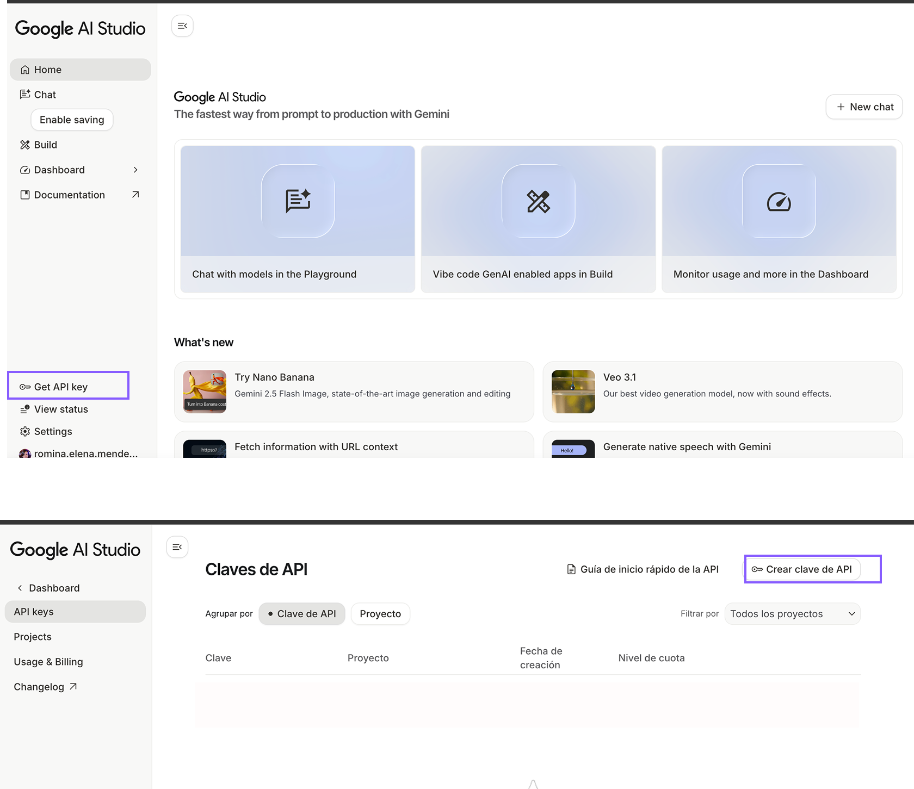

[](https://www.buymeacoffee.com/r0mymendez)

---

# How to Use AI in Brand Journalism with Gemini to Transform Digital Information into Strategic Editorial Content?

# Introduction
In a hyperconnected world, every post, comment, or interaction contributes to building a brand's reputation. Therefore, identifying what people are talking about and turning it into stories that inform, inspire, and connect is essential for any modern communication strategy.


This repository was born from a concrete question: **how can Generative AI be used to discover what is being said about a company and transform that information into relevant stories?** Stories that reflect real experiences and concerns, turning them into inspiring narratives that strengthen brand identity.



---

In this tutorial, you will learn how to use Google Gemini to:

* **🔍 Search for information** using generative AI integrated with Google Search
* **✍️ Transform findings** into structured journalistic narratives
* **📊 Generate visual reports** with graphics and automated storytelling

---

# What is Brand Journalism?
According to an article by [The New York Times Licensing Group](https://nytlicensing.com/latest/marketing/brand-journalism-and-why-it-matters/), readers experience significant content fatigue: there are more than 1.8 billion websites and over 70 million blogs published each month.

Brand Journalism is a communication strategy where brands adopt journalistic techniques to tell relevant and engaging stories. Instead of direct advertising messages, content is created with a narrative, informative, and value-added approach, similar to traditional media.




---

## Key Features

* **Journalistic techniques:** Application of rigorous journalistic methods to create credible and well-structured content.
* **Audience interests:** Focus on the real interests of the audience, not just the messages the brand wants to convey.
* **Quality and useful information**: Content that educates, informs, or solves concrete problems.
* **Use of different formats:** Variety of formats (reports, interviews, analyses, infographics, videos) to maintain engagement.
* **Storytelling:** Narratives that connect emotionally with values, experiences, and social impact.


---

## Benefits
The benefits we can identify based on this are:
* **Brand Positioning:** Establish yourself as a thought leader in your industry.
* **Audience Loyalty:** Build authentic and lasting relationships with your audience.
* **Differentiation against the Competition:** Stand out from competitors through higher-quality editorial content.
* **Greater Organic Reach:** Valuable content is naturally shared, amplifying reach without direct advertising investment.



---

# What is Generative AI?
Generative AI is a branch of artificial intelligence focused on creating new and original content: text, images, audio, video, or synthetic data. Its development has been possible thanks to deep learning, especially through advanced architectures such as transformers, which process information in parallel and capture complex relationships in large data volumes.




## Additional Resources on GenAI 
I have written a series of articles on the fundamentals of generative AI

1. [GenAI Foundations – Chapter 1: Prompt Basics: From Theory to Practice](https://dev.to/r0mymendez/genai-foundations-chapter-1-prompt-basics-from-theory-to-practice-1a5)
2. [GenAI Foundations – Chapter 2: Prompt Engineering in Action – Unlocking Better AI Responses](https://dev.to/r0mymendez/genai-foundations-chapter-2-prompt-engineering-in-action-unlocking-better-ai-responses-l28)
3. [GenAI Foundations – Chapter 3: RAG Patterns and Best Practices](https://dev.to/r0mymendez/genai-foundations-chapter-3-rag-patterns-and-best-practices-cpc)
4. [GenAI Foundations – Chapter 4: Model Customization & Evaluation – Can We Trust the Outputs?](https://dev.to/r0mymendez/genai-foundations-chapter-4-model-customization-evaluation-can-we-trust-the-outputs-i21)
5. [GenAI Foundations – Chapter 5: Project Planning with the Generative AI Canvas](https://dev.to/r0mymendez/genai-foundations-chapter-5-project-planning-with-the-generative-ai-canvas-2o73)

----

## Gemini
**Gemini** is a family of multimodal AI models developed by Google DeepMind. It integrates into multiple Google products and can process text, images, and other data types simultaneously.

### Grounding with Google Search 
For this use case, we will use the Grounding with Google Search functionality, which connects the model directly to Google to perform searches and obtain up-to-date information.




---

## Grounding with Google Search
For this use case, we will use the Grounding with Google Search functionality, which connects the model directly to Google to perform searches and obtain up-to-date information.

### Main Advantages:
* **📏Increased Accuracy:** Reduces model hallucinations by accessing verifiable information.
* **⚡️Real-Time Information:** Access to current data, reducing uncertainty about the model's knowledge.
* **📚Citations and References:** Retrieves source links and provides control over consulted data sources.

---

# Use Case 
Brand Journalism is a strategic tool for companies to communicate their values from an authentic perspective. However, we often need to find topics that might interest our target audience, so it is essential to search for:

* Mentions of the company on different sites
* Reputation and notable aspects
* Trends and relevant conversations

This starting point helps those who write articles or create storytelling based not only on what the company wants to show but also on the external perspective others have of it.

---

## Practical Example: 📱iPhone 17 
Using the latest iPhone launch as an example, we will:
1. Search for recently published articles
2. Classify and analyze these documents
3. Generate a report with visualizations, conclusions, and structured narratives

> Next, we will see how to implement this strategy through an automated workflow that integrates AI and data analysis.

---

## Implementation Process
The following diagram illustrates how our automated analysis system works.


### 1️⃣ Search with Google Search
We use **Grounding with Google Search** to find relevant articles and request output in JSON format using this structure:

```json
{ 
   "title": "full article title",
   "source_name": "media name",
   "date": "publication date",
   "url": "article link",
   "site_name": "website name",
   "summary": "2-4 line summary",
   "sentiment": "positive/negative/neutral",
   "category": "rumor/analysis/comparison/market/technical",
   "sentiment_score": "1-10 score"
 }

```

### 2️⃣ Storytelling Generation
We use another prompt to generate different types of narratives based on the articles found:
* **Analytical Insights:** Compact analytical summary with concrete data.
* **Storytelling Narrative:** Engaging mini-narrative based on dataset evidence.
* **Tone Variants (A/B/C):** Three versions with different focuses: objective, emotional, and strategic.

### 3️⃣ Report Creation
We generate a PDF report including:
* Charts created with Seaborn and Matplotlib
* Visual trend analyses
* Narrative conclusions based on generated storytelling
* Customizing the layout using ReportLab

---

# Tutorial
## How Does Gemini Work with Google Search?
When performing a query, Gemini not only relies on its internal knowledge but also actively searches updated information on Google Search. This grounding capability allows the model to access real-time data, verify facts, and provide responses based on concrete sources, reducing hallucination risk and ensuring relevance.





## Pre-requisite: Access to Gemini API
Before starting, you need to get access to the Gemini API:
1. Create an account in [Google AI Studio](https://aistudio.google.com/)
2. Create or log in with your Google account
3. Generate your API key from the control panel

> Note: You can use Gemini's free tier to test this project.





Once you have your API key, configure it in a .env file:
```bash
API_KEY = "tu_api_key_de_gemini"
MODEL_ID = "gemini-2.5-flash"
```
> We use Gemini 2.5 Flash because it is the most cost-efficient model optimized for frequent, low-cost tasks.


